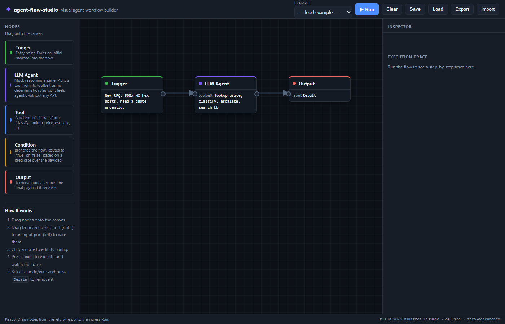

# agent-flow-studio

The business idea behind this: an ops team keeps filing small-automation requests — route these tickets, triage these emails — and each one waits weeks in the engineering backlog. Let business users assemble the simple ones on a canvas themselves and those flows land the same day instead, which on an illustrative model frees roughly **€47k of engineering time a year** and turns a multi-week wait into an afternoon (estimate — the arithmetic is in the business case). This repo is the working proof-of-concept of that pattern.



**Business case:** [docs/BUSINESS_CASE.md](docs/BUSINESS_CASE.md) has the situation, the numbers and the ROI on one page, and [deliverables/executive_onepager.pdf](deliverables/executive_onepager.pdf) is the version a manager can circulate.

A small visual agent-workflow builder that runs entirely in the browser. You drag nodes onto a canvas, wire the ports together, hit Run, and watch a mock agent walk the graph and pick tools step by step. No backend, no build step, no npm install, no API key.

I built it because low-code platforms like n8n look like magic from the outside, and the fastest way to stop them being magic is to build a tiny one. This is the "I understand the canvas from the inside" piece of my portfolio, put together while applying for agentic-automation internships. Its sibling repo, `agentic-automation-lab`, compares low-code and full-code agents head to head; this one is about what the canvas itself is doing.

## The parts that were actually interesting to build

Two things took the real work, and both were on purpose kept dependency-free:

**Drawing the wires.** Each connection is an SVG path from an output port on one node to an input port on another, redrawn every time you drag a node so it stays attached. Getting the ports to line up while nodes move around, rejecting cycles so the graph stays a DAG, and deleting a wire cleanly took more fiddling than the node dragging did.

**Running the graph.** The executor does a real topological sort (Kahn's algorithm) with cycle detection, then walks the nodes in order, highlights each one as it runs, lights up the live wires, and streams a trace. A `Condition` node prunes the branch that didn't fire so downstream nodes on the dead path don't execute. All of that lives in `engine.js`, which is a single UMD module. The exact same file runs in the browser and in the Node test suite, so what you see animate is the code the tests cover.

The agent itself is a mock: `mockAgentReason` scans the payload and picks a tool from its toolbelt with a small keyword-rule table. It's the "observe → decide → act → narrate" shape of a real agent with the LLM swapped out for deterministic rules, which is what keeps the whole thing offline and testable.

## Running it

```bash
python -m http.server 8000     # then open http://localhost:8000
node --test                    # 16 tests, pure engine logic
```

You can also just double-click `index.html` — everything works offline except loading the bundled example flows from the dropdown, because browsers block `fetch()` over `file://`. Serving the folder fixes that, or you can Import an example `.json` by hand. Two examples ship in `examples/`: an RFQ triage flow and a support-ticket router.

## Node types

Five of them: `Trigger` emits a payload, `LLM Agent` reasons over its toolbelt and picks a tool, `Tool` is a pure transform (classify, lookup-price, escalate, and a few more), `Condition` routes down one branch, `Output` captures the result. Flows persist to `localStorage` and export/import as JSON.

## Where it stops

- The agent is rule-based, not a real model. Deliberate, but it's not natural-language reasoning.
- No retries, timeouts, parallel branches, sub-flows, loops, or auth. Flows have to be acyclic.
- State lives in the page and `localStorage`. Single user, no server, no versioning.

It's meant to be small enough to read in one sitting, not to compete with n8n on features.

## Next

The thing I'd add is a real provider behind the agent node — keep the mock as the default, but let you flip a node to call an actual model and reason over the toolbelt for real, the same way the sibling repo does it.

---

Built by Dimitres Kisimov. © 2026 Dimitres Kisimov — all rights reserved; published for portfolio review. See LICENSE.
